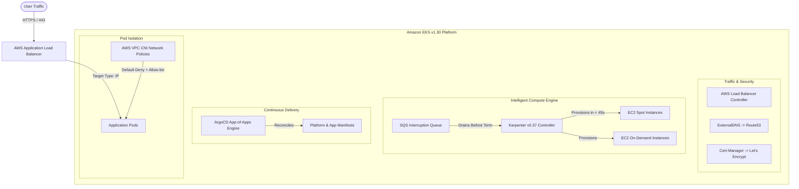

# ⚡ AWS EKS Production Platform

[](https://github.com/ekrmcakir/aws-eks-production-platform/actions/workflows/ci.yml)
[](https://www.terraform.io/)
[](https://kubernetes.io/)
[](https://karpenter.sh/)
[](https://argo-cd.readthedocs.io/)
[](https://docs.aws.amazon.com/eks/latest/userguide/cni-network-policy.html)
[](LICENSE)

An enterprise-ready, production-grade **Kubernetes Platform Architecture on Amazon EKS (v1.30)** engineered for high availability, sub-minute just-in-time autoscaling, declarative GitOps continuous delivery, and Zero-Trust pod isolation.

Provisioned entirely via modular **Terraform Infrastructure as Code (IaC)** and managed continuously with **ArgoCD**.

---

## 🏛️ Architecture Overview

```
                                      Internet
                                          │
                     ┌────────────────────▼────────────────────┐
                     │    Route53 (Automated via ExternalDNS)  │
                     └────────────────────┬────────────────────┘
                                          │
                     ┌────────────────────▼────────────────────┐
                     │      AWS Application Load Balancer      │
                     │  (SSL Managed by Cert-Manager Let's Enc)│
                     └────────────────────┬────────────────────┘
                                          │
══════════════════════════════════════════╪══════════════════════════════════════════════
AWS VPC (Multi-AZ 10.0.0.0/16)            │
 ┌────────────────────────────────────────▼────────────────────────────────────────────┐
 │  Private Subnets (EKS Worker Nodes & Workloads)                                     │
 │                                                                                     │
 │  ┌──────────────────────────┐             ┌──────────────────────────────────────┐  │
 │  │ System Critical Nodes    │             │ Karpenter Just-In-Time Nodes         │  │
 │  │ (On-Demand Managed Group)│             │ (Spot & On-Demand Dynamic NodePools) │  │
 │  │                          │             │                                      │  │
 │  │  • CoreDNS               │             │  • Business Workloads                │  │
 │  │  • Karpenter Controller  │             │  • Microservices (Order/Inventory)   │  │
 │  │  • ArgoCD GitOps Engine  │             │  • Zero-Trust VPC CNI NetPolicies    │  │
 │  │  • AWS LB Controller     │             │  • AL2023 gp3 Encrypted Storage      │  │
 │  └──────────────────────────┘             └──────────────────────────────────────┘  │
 └─────────────────────────────────────────────────────────────────────────────────────┘
                                          │
 ┌────────────────────────────────────────▼────────────────────────────────────────────┐
 │  EKS Control Plane v1.30 (KMS Envelope Encrypted Secrets + OIDC IRSA Security)      │
 └─────────────────────────────────────────────────────────────────────────────────────┘
══════════════════════════════════════════════════════════════════════════════════════════
```

### Key Architectural Highlights



---

## 🎯 Production Engineering Pillars

### 1. ⚡ Karpenter vs. Legacy Cluster Autoscaler
| Feature | Legacy Cluster Autoscaler | Karpenter (This Platform) |
| :--- | :--- | :--- |
| **Provisioning Speed** | 3 – 7 minutes (ASG delays) | **Under 45 seconds** (direct Fleet API) |
| **Node Selection** | Fixed static node groups | **Just-in-time bin-packing** based on exact pod requirements |
| **Cost Optimization** | Manual spot/on-demand splits | **Automatic Spot-first scheduling** with graceful 2-min SQS draining |
| **De-provisioning** | Slow, prone to stranded capacity | **Consolidation: WhenUnderutilized** terminates unneeded instances in 30s |

### 2. 🛡️ Enterprise Zero-Trust & Cloud Security
- **Native AWS VPC CNI Network Policies**: Built-in pod-level firewalling with `default-deny-all` and explicit whitelist rules without requiring heavy third-party overlays.
- **KMS Envelope Encryption**: All Kubernetes Secrets are encrypted at rest using an AWS KMS Customer Managed Key (CMK).
- **IAM Roles for Service Accounts (IRSA)**: Zero static IAM credentials. Controllers (`Karpenter`, `AWS LBC`, `ExternalDNS`, `EBS CSI`) use fine-grained OpenID Connect (OIDC) federated STS temporary tokens.
- **Rootless & Hardened Containers**: Application deployments enforce `readOnlyRootFilesystem: true`, `allowPrivilegeEscalation: false`, and run as non-root users (`uid: 10001`).

### 3. 🚀 Declarative GitOps via ArgoCD (App-of-Apps Pattern)
- A single **Root Application** (`gitops/bootstrap/root-app.yaml`) automatically syncs the entire cluster topology:
  - **Platform layer**: Karpenter NodePools, NetworkPolicies, ClusterIssuer.
  - **Application layer**: Microservices, HPA, Services, and ALBs.

---

## 📂 Repository Structure

```text
aws-eks-production-platform/
├── .github/
│   └── workflows/
│       └── ci.yml                 # Terraform format, lint, and manifest verification
├── terraform/                     # Modular Infrastructure as Code
│   ├── versions.tf                # Provider requirements (AWS, Helm, Kubernetes, TLS)
│   ├── variables.tf               # Environment variables
│   ├── vpc.tf                     # 3-AZ resilient VPC with dedicated subnet tagging
│   ├── eks.tf                     # EKS v1.30 cluster, KMS encryption, bootstrap node group
│   ├── addons.tf                  # VPC CNI Network Policy, CoreDNS, EBS CSI driver
│   ├── karpenter.tf               # Karpenter IRSA, SQS interruption handling, Helm release
│   ├── load_balancer_controller.tf# AWS LBC Helm chart and IRSA IAM configuration
│   ├── external_dns.tf            # Route53 automated record synchronization
│   ├── cert_manager.tf            # Automated Let's Encrypt TLS certificate provisioning
│   ├── argocd.tf                  # ArgoCD GitOps engine bootstrap
│   ├── outputs.tf                 # Cluster and infrastructure outputs
│   └── terraform.tfvars.example   # Sample environment configurations
├── gitops/                        # Declarative Kubernetes Manifests
│   ├── bootstrap/                 # ArgoCD App-of-Apps root definitions
│   ├── platform/                  # Karpenter NodePools, NetworkPolicies, ClusterIssuer
│   └── apps/microservices/        # Production reference microservice deployment
├── scripts/
│   ├── deploy_platform.sh         # End-to-end automated platform bootstrap script
│   └── validate_cluster.sh        # Health check and validation test harness
├── Makefile                       # One-touch developer operations
├── LICENSE                        # MIT License
└── README.md                      # Architecture documentation
```

---

## ⚡ Quickstart & Deployment Guide

### Prerequisites
1. **AWS CLI v2** configured with Administrator permissions (`aws sts get-caller-identity`).
2. **Terraform** >= 1.5.0 (`terraform -version`).
3. **kubectl** >= 1.30 (`kubectl version --client`).

### 1. Clone & Configure
```bash
git clone https://github.com/ekrmcakir/aws-eks-production-platform.git
cd aws-eks-production-platform/terraform

cp terraform.tfvars.example terraform.tfvars
# Update region and cluster parameters as needed
```

### 2. Deploy Infrastructure
```bash
# Initialize and validate
make init
make validate

# Plan and apply
make apply
```

### 3. Connect to Cluster & Bootstrap GitOps
```bash
# Update kubeconfig
make kubeconfig

# Bootstrap ArgoCD Root Application
kubectl apply -f ../gitops/bootstrap/root-app.yaml

# Run automated validation suite
make verify
```

---

## 📊 Cluster Verification & Output Sample

Running `make verify` executes the diagnostic test harness:

```text
==================================================================
 🔍 Starting Platform Validation: eks-production-platform in us-east-1
==================================================================
[1/7] Checking EKS Control Plane Status... ✅ ACTIVE
[2/7] Checking Kubernetes Node Readiness... ✅ (2 nodes Ready)
[3/7] Verifying Karpenter Controller... ✅ Running
[4/7] Verifying AWS Load Balancer Controller... ✅ Running
[5/7] Verifying ArgoCD Server & Repo Controller... ✅ Running
[6/7] Verifying VPC CNI Network Policy Daemon... ✅ ENABLED
[7/7] Verifying Cert-Manager Webhook & Controller... ✅ Running
==================================================================
 🎉 All EKS Platform Checks Completed Successfully!
==================================================================
```

---

## 📄 License
This project is licensed under the MIT License — see the [LICENSE](LICENSE) file for details.

---

<div align="center">
  <b>Designed & Built with Cloud-Native Best Practices by <a href="https://github.com/ekrmcakir">Ekrem Cakir</a></b><br>
  <i>"Automate everything. Trust nothing. Least privilege always."</i>
</div>
